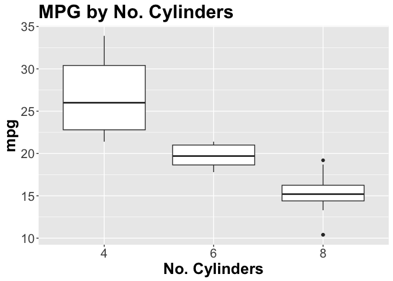

<!-- README.md is generated from README.Rmd. Please edit that file -->

# grp1ProjectPackage

<!-- badges: start -->


[](https://app.codecov.io/gh/DSCI-310/dsci-310-group-01-pkg?branch=main)
<!-- badges: end -->

The goal of grp1ProjectPackage is to provide user a package for
simplifying data pre-processing and doing basic exploratory data
analyses. It includes functions for loading data from an html, removing
certain columns from a data set, creating boxplots, and splitting data
into training and testing sets.

## Installation

You can install the development version of grp1ProjectPackage from
[GitHub](https://github.com/) with:

``` r
# install.packages("devtools")
devtools::install_github("DSCI-310/dsci-310-group-01-pkg")
```

### Functions Included:

- `load_data()`
- `clean_data()`
- `create_boxplot()`
- `train_test_split()`

## Example

This is a basic example which shows you how to solve a common problem:

``` r
library(grp1ProjectPackage)
## basic example code
```

1.  Load data from a URL using `load_data()`

``` r
data<-load_data("https://7e6cd356-86ad-4874-abc7-3a69bbbc39e6.filesusr.com/ugd/c5a545_c1b17c070c984dfcb14cf1c3bb0b6e67.csv?dn=garments_worker_productivity.csv")
head(data)
#> # A tibble: 6 × 15
#>   date   quarter depar…¹ day    team targe…²   smv   wip over_…³ incen…⁴ idle_…⁵
#>   <chr>  <chr>   <chr>   <chr> <dbl>   <dbl> <dbl> <dbl>   <dbl>   <dbl>   <dbl>
#> 1 1/1/2… Quarte… sweing  Thur…     8    0.8  26.2   1108    7080      98       0
#> 2 1/1/2… Quarte… finish… Thur…     1    0.75  3.94    NA     960       0       0
#> 3 1/1/2… Quarte… sweing  Thur…    11    0.8  11.4    968    3660      50       0
#> 4 1/1/2… Quarte… sweing  Thur…    12    0.8  11.4    968    3660      50       0
#> 5 1/1/2… Quarte… sweing  Thur…     6    0.8  25.9   1170    1920      50       0
#> 6 1/1/2… Quarte… sweing  Thur…     7    0.8  25.9    984    6720      38       0
#> # … with 4 more variables: idle_men <dbl>, no_of_style_change <dbl>,
#> #   no_of_workers <dbl>, actual_productivity <dbl>, and abbreviated variable
#> #   names ¹​department, ²​targeted_productivity, ³​over_time, ⁴​incentive,
#> #   ⁵​idle_time
```

2.  Dropping columns with `clean_data()`

For the purpose of demonstration for the rest of the package, we will
use a basic data set called `mtcars`.

``` r
head(mtcars)
#>                    mpg cyl disp  hp drat    wt  qsec vs am gear carb
#> Mazda RX4         21.0   6  160 110 3.90 2.620 16.46  0  1    4    4
#> Mazda RX4 Wag     21.0   6  160 110 3.90 2.875 17.02  0  1    4    4
#> Datsun 710        22.8   4  108  93 3.85 2.320 18.61  1  1    4    1
#> Hornet 4 Drive    21.4   6  258 110 3.08 3.215 19.44  1  0    3    1
#> Hornet Sportabout 18.7   8  360 175 3.15 3.440 17.02  0  0    3    2
#> Valiant           18.1   6  225 105 2.76 3.460 20.22  1  0    3    1
```

Dropping a column named `mpg` from mtcars.

``` r
head(clean_data(mtcars, "mpg"))
#>                   cyl disp  hp drat    wt  qsec vs am gear carb
#> Mazda RX4           6  160 110 3.90 2.620 16.46  0  1    4    4
#> Mazda RX4 Wag       6  160 110 3.90 2.875 17.02  0  1    4    4
#> Datsun 710          4  108  93 3.85 2.320 18.61  1  1    4    1
#> Hornet 4 Drive      6  258 110 3.08 3.215 19.44  1  0    3    1
#> Hornet Sportabout   8  360 175 3.15 3.440 17.02  0  0    3    2
#> Valiant             6  225 105 2.76 3.460 20.22  1  0    3    1
```

As you can see above, the column mpg has been dropped from the data
frame.

3.  Creating a boxplot using `create_boxplot()`

``` r
create_boxplot(mtcars, as.factor(mtcars$cyl), mtcars$mpg, "MPG by No. Cylinders", "No. Cylinders", "mpg")
```



4.  Splitting data into training and testing sets using
    `train_test_split()`

``` r
 train_test_split(mtcars, 0.75, "mpg")
#> [[1]]
#>                     mpg cyl  disp  hp drat    wt  qsec vs am gear carb
#> Merc 450SLC        15.2   8 275.8 180 3.07 3.780 18.00  0  0    3    3
#> Mazda RX4 Wag      21.0   6 160.0 110 3.90 2.875 17.02  0  1    4    4
#> Volvo 142E         21.4   4 121.0 109 4.11 2.780 18.60  1  1    4    2
#> Valiant            18.1   6 225.0 105 2.76 3.460 20.22  1  0    3    1
#> Cadillac Fleetwood 10.4   8 472.0 205 2.93 5.250 17.98  0  0    3    4
#> Merc 280           19.2   6 167.6 123 3.92 3.440 18.30  1  0    4    4
#> Lotus Europa       30.4   4  95.1 113 3.77 1.513 16.90  1  1    5    2
#> Hornet Sportabout  18.7   8 360.0 175 3.15 3.440 17.02  0  0    3    2
#> Mazda RX4          21.0   6 160.0 110 3.90 2.620 16.46  0  1    4    4
#> Duster 360         14.3   8 360.0 245 3.21 3.570 15.84  0  0    3    4
#> Fiat 128           32.4   4  78.7  66 4.08 2.200 19.47  1  1    4    1
#> Chrysler Imperial  14.7   8 440.0 230 3.23 5.345 17.42  0  0    3    4
#> Pontiac Firebird   19.2   8 400.0 175 3.08 3.845 17.05  0  0    3    2
#> Merc 280C          17.8   6 167.6 123 3.92 3.440 18.90  1  0    4    4
#> Toyota Corona      21.5   4 120.1  97 3.70 2.465 20.01  1  0    3    1
#> Hornet 4 Drive     21.4   6 258.0 110 3.08 3.215 19.44  1  0    3    1
#> Merc 450SE         16.4   8 275.8 180 3.07 4.070 17.40  0  0    3    3
#> Toyota Corolla     33.9   4  71.1  65 4.22 1.835 19.90  1  1    4    1
#> Ford Pantera L     15.8   8 351.0 264 4.22 3.170 14.50  0  1    5    4
#> Merc 230           22.8   4 140.8  95 3.92 3.150 22.90  1  0    4    2
#> Dodge Challenger   15.5   8 318.0 150 2.76 3.520 16.87  0  0    3    2
#> Porsche 914-2      26.0   4 120.3  91 4.43 2.140 16.70  0  1    5    2
#> Merc 240D          24.4   4 146.7  62 3.69 3.190 20.00  1  0    4    2
#> Fiat X1-9          27.3   4  79.0  66 4.08 1.935 18.90  1  1    4    1
#> 
#> [[2]]
#>                mpg cyl  disp  hp drat   wt  qsec vs am gear carb
#> Merc 450SL    17.3   8 275.8 180 3.07 3.73 17.60  0  0    3    3
#> Camaro Z28    13.3   8 350.0 245 3.73 3.84 15.41  0  0    3    4
#> Ferrari Dino  19.7   6 145.0 175 3.62 2.77 15.50  0  1    5    6
#> Maserati Bora 15.0   8 301.0 335 3.54 3.57 14.60  0  1    5    8
```

## Contributing

We appreciate contributions to the `grp1ProjectPackage` package. Please
refer to our [Contributing
document](https://github.com/jw327/dsci-310-group-01-pkg/blob/main/CONTRIBUTING.md)
and [Code of
Conduct](https://github.com/jw327/dsci-310-group-01-pkg/blob/main/CODE_OF_CONDUCT.md)
for more information.

## License

This project, developed by Justin Wong, Longfei Guan, and Anirudh
Duggal, is licensed under the terms of the MIT license.

Permission is hereby granted, free of charge, to any person obtaining a
copy of this software and associated documentation files (the
“Software”), to deal in the Software without restriction, including
without limitation the rights to use, copy, modify, merge, publish,
distribute, sublicense, and/or sell copies of the Software, and to
permit persons to whom the Software is furnished to do so, subject to
the following conditions:

The above copyright notice and this permission notice shall be included
in all copies or substantial portions of the Software.

THE SOFTWARE IS PROVIDED “AS IS”, WITHOUT WARRANTY OF ANY KIND, EXPRESS
OR IMPLIED, INCLUDING BUT NOT LIMITED TO THE WARRANTIES OF
MERCHANTABILITY, FITNESS FOR A PARTICULAR PURPOSE AND NONINFRINGEMENT.
IN NO EVENT SHALL THE AUTHORS OR COPYRIGHT HOLDERS BE LIABLE FOR ANY
CLAIM, DAMAGES OR OTHER LIABILITY, WHETHER IN AN ACTION OF CONTRACT,
TORT OR OTHERWISE, ARISING FROM, OUT OF OR IN CONNECTION WITH THE
SOFTWARE OR THE USE OR OTHER DEALINGS IN THE SOFTWARE.
